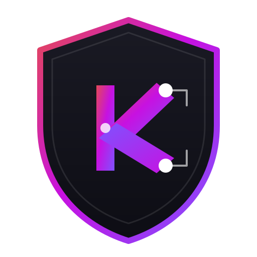

# Kodium

[](https://search.maven.org/artifact/eu.livotov.labs/kodium)
[](https://opensource.org/licenses/Apache-2.0)
[](http://kotlinlang.org)
[](http://kotlinlang.org)

<p align="center">
  
</p>

**Secure. Portable. Pure Kotlin.**

**Kodium** is a comprehensive, pure Kotlin Multiplatform (KMP) cryptography library. It acts as a faithful port of the renowned **TweetNaCl** C library, providing high-speed, high-security cryptographic primitives, advanced **Double Ratchet** session management, and **Post-Quantum Cryptography (PQC)** protocols without *any* native dependencies. 

Write once, encrypt everywhere. Even in a post-quantum world.

---

## 📑 Table of Contents
1. [Why Kodium?](#-why-kodium)
2. [Supported Platforms](#-supported-platforms)
3. [Features](#-features)
4. [Installation](#-installation)
5. [Quick Start Guide](#-quick-start)
   - [Secure Messaging (Double Ratchet)](#1-secure-messaging-double-ratchet)
   - [Post-Quantum Encryption (Hybrid PQC)](#2-post-quantum-encryption-hybrid-pqc)
   - [Asymmetric Encryption (Box)](#3-asymmetric-encryption-box)
   - [Symmetric Encryption (SecretBox)](#4-symmetric-encryption-secretbox)
   - [Key Export & Import](#5-key-export--import)
6. [Examples and Deep Dives](#-examples--deep-dives)
6. [Utilities](#-utilities)
   - [Base58 Encoding](#base58-encoding)
   - [Password-Based Key Derivation (PBKDF2)](#password-based-key-derivation-pbkdf2)
7. [Release Notes](#-release-notes)
8. [License & Disclaimer](#-license)

---

## ⚡️ Why Kodium?

*   **Pure Kotlin:** No JNI, no C interop headaches, no complex build scripts for native binaries. Just pure Kotlin code running everywhere.
*   **TweetNaCl Core:** Built on the solid foundation of the TweetNaCl crypto suite, known for its security and simplicity.
*   **Post-Quantum Ready:** Hybrid cryptographic primitives combining classical X25519 with FIPS 203 (ML-KEM) to protect against future quantum computers.
*   **Double Ratchet:** Includes a full implementation of the Double Ratchet Algorithm and X3DH for secure End-to-End Encryption (E2EE).
*   **Multiplatform Native:** First-class support for Android, iOS, JVM, JavaScript (Browser/Node), Wasm, Linux, macOS, and Windows.
*   **Developer Friendly:** Simple, opinionated APIs for common tasks (Box, SecretBox, Signatures).

---

## 🌍 Supported Platforms

| Platform | Support |
| :--- | :---: |
| **Android** | ✅ |
| **iOS** (Arm64, X64, Sim) | ✅ |
| **JVM** (Java 17+) | ✅ |
| **JavaScript** (Browser/Node) | ✅ |
| **Wasm** (WebAssembly) | ✅ |
| **macOS** (Arm64, X64) | ✅ |
| **Linux** (X64) | ✅ |
| **Windows** (MinGW X64) | ✅ |

---

## 🛠 Features

*   **End-to-End Encryption:** Double Ratchet Algorithm & X3DH (Extended Triple Diffie-Hellman).
*   **Post-Quantum Hybrid Encryption:** FIPS 203 (ML-KEM-768) + Curve25519 authenticated encryption.
*   **Public-Key Cryptography (Box):** Authenticated encryption using Curve25519, XSalsa20, and Poly1305.
*   **Secret-Key Cryptography (SecretBox):** Authenticated encryption using XSalsa20 and Poly1305.
*   **Digital Signatures:** Ed25519 high-speed, high-security signatures.
*   **Key Management:** Secure generation, import, and export of keys (Raw & Base58Check).
*   **Utils:** Robust Base58Check encoding/decoding and HKDF (RFC 5869).

---

## 📦 Installation

Add Kodium to your common module's dependencies.

**Gradle (Kotlin DSL)**
```kotlin
implementation("eu.livotov.labs:kodium:1.0.0")
```

**Gradle (Groovy)**
```groovy
implementation 'eu.livotov.labs:kodium:1.0.0'
```

**Maven**
```xml
<dependency>
    <groupId>eu.livotov.labs</groupId>
    <artifactId>kodium</artifactId>
    <version>1.0.0</version>
</dependency>
```

---

## 🚀 Quick Start

### 1. Secure Messaging (Double Ratchet)
Kodium provides a complete implementation of the Double Ratchet algorithm for secure E2EE messaging.

```kotlin
// Alice initializes her session as the initiator
val aliceSession = DoubleRatchetSession.initializeAsInitiator(sharedSecret, responderRatchetKey)

// Encrypt a message to a Base58 string
val encrypted = aliceSession.encryptToEncodedString("Hello Bob!".encodeToByteArray()).getOrThrow()

// Bob decrypts it back
val bobSession = DoubleRatchetSession.initializeAsResponder(sharedSecret, responderRatchetKeyPair)
val decrypted = bobSession.decryptFromEncodedString(encrypted).getOrThrow()
```

### 2. Post-Quantum Secure Messaging (PQ Double Ratchet)
Upgrade your E2EE sessions to be resistant to quantum computer attacks using the `PQDoubleRatchetSession`.

```kotlin
// Alice initializes her PQ session using the secrets from PQXDH
val aliceSession = PQDoubleRatchetSession.initializeAsInitiator(
    sharedSecret = aliceSharedSecret.masterSecret,
    responderPqcPublicKey = fetchedBobBundle.pqcKey,
    ourPqcPrivateKey = aliceHybridKeys
)

val encrypted = aliceSession.encryptToEncodedString("Post-Quantum Hello!".encodeToByteArray()).getOrThrow()

// Bob initializes his session using his keys and Alice's provided payload
val bobSession = PQDoubleRatchetSession.initializeAsResponder(
    sharedSecret = bobSharedSecret,
    ourPqcPrivateKey = bobHybridKeys,
    initiatorPqcPublicKey = fetchedAlicePayload.pqcPublicKey!!
)
val decrypted = bobSession.decryptFromEncodedString(encrypted).getOrThrow()
```

### 2. Post-Quantum Encryption (Hybrid PQC)
Protect your data against future quantum computer attacks using the hybrid `Kodium.pqc` suite.

```kotlin
// 1. Generate Hybrid Keys (X25519 + ML-KEM-768)
val myKeys = Kodium.pqc.generateKeyPair()
val theirPublicKey = ... // Received from peer

// 2. Encrypt
val encrypted = Kodium.pqc.encryptToEncodedString(
    mySecretKey = myKeys,
    theirPublicKey = theirPublicKey,
    data = "Secret message".encodeToByteArray()
).getOrThrow()

// 3. Decrypt
val decrypted = Kodium.pqc.decryptFromEncodedString(
    mySecretKey = myKeys,
    theirPublicKey = theirPublicKey,
    data = encrypted
).getOrThrow()
```

### 3. Asymmetric Encryption (Box)
Securely exchange messages between Alice and Bob without session management.

```kotlin
// 1. Generate keys
val alice = Kodium.generateKeyPair()
val bob = Kodium.generateKeyPair()

// 2. Alice encrypts a message for Bob
val message = "The eagle flies at midnight.".encodeToByteArray()

val encryptedResult = Kodium.encryptToEncodedString(
    mySecretKey = alice,
    theirPublicKey = bob.getPublicKey(),
    data = message
)

// 3. Bob decrypts the message
encryptedResult.onSuccess { cipherText ->
    Kodium.decryptFromEncodedString(
        mySecretKey = bob,
        theirPublicKey = alice.getPublicKey(),
        data = cipherText
    ).onSuccess { decryptedBytes ->
        println("Decrypted: ${decryptedBytes.decodeToString()}")
    }
}
```

### 4. Symmetric Encryption (SecretBox)
Protect data with a shared password/secret.

```kotlin
val password = "CorrectHorseBatteryStaple"
val secretData = "Launch codes: 12345".encodeToByteArray()

// Encrypt
val encryptedResult = Kodium.encryptSymmetricToEncodedString(password, secretData)

// Decrypt
encryptedResult.onSuccess { cipherText ->
    val decryptedResult = Kodium.decryptSymmetricFromEncodedString(password, cipherText)
    println("Restored: ${decryptedResult.getOrThrow().decodeToString()}")
}
```

### 5. Key Export & Import
Easily store keys using Base58Check encoding.

```kotlin
val keyPair = Kodium.generateKeyPair()

// Export Public Key (Safe to share)
val pubKeyString = keyPair.getPublicKey().exportToEncodedString()

// Export Private Key (Encrypted with a password)
val privKeyString = keyPair.exportToEncryptedString("StrongPassword")

// Import later
val restoredKeyPair = KodiumPrivateKey.importFromEncryptedString(
    data = privKeyString.getOrThrow(), 
    password = "StrongPassword"
)
```

---

## 🛠 Utilities

### Base58 Encoding
Kodium provides efficient Base58 and Base58Check extensions for `ByteArray` and `String`. Base58 is superior to Base64 for many crypto use cases as it eliminates ambiguous characters (0OIl) and is more compact than hexadecimal.

```kotlin
val data = "Kodium Pure Kotlin".encodeToByteArray()

// Standard Base58
val b58 = data.encodeToBase58String()
val decoded = b58.decodeBase58()

// Base58 with Checksum (Standard in Bitcoin/Crypto)
val b58Check = data.encodeToBase58WithChecksum()
val decodedCheck = b58Check.decodeBase58WithChecksum()
```

### Password-Based Key Derivation (PBKDF2)
Derive strong cryptographic keys from user passwords using PBKDF2 with HMAC-SHA256.

```kotlin
val password = "UserPassword123".encodeToByteArray()
val salt = "RandomSalt".encodeToByteArray() // Should be random and at least 16 bytes

// Derive a 32-byte key
val derivedKey = KDF.deriveKey(
    password = password,
    salt = salt,
    iterations = 100_000,
    keyLengthBytes = 32
)
```

---

## 📚 Examples & Deep Dives

For advanced usage and detailed technical explanations, refer to our deep-dive standalone guides.

### 1. End-to-End Encrypted Chat (Double Ratchet)
Learn how to build a fully secure, asynchronous peer-to-peer chat application using the classical Double Ratchet protocol. This guide covers the complete lifecycle:
*   Account creation and public key publishing.
*   Asynchronous X3DH handshake.
*   Session initialization and secure message exchange.
*   Advanced topics like Context Binding and Session State Persistence.

👉 **[Read the full Double Ratchet & X3DH Guide](RATCHET.md)**

### 2. Post-Quantum Cryptography (PQC)
Future-proof your application against "Harvest Now, Decrypt Later" attacks by upgrading to Kodium's Hybrid PQC suite. This guide covers:
*   The theory behind mixing X25519 with FIPS 203 (ML-KEM-768).
*   Managing and persisting large Hybrid Keys.
*   Establishing a Post-Quantum Double Ratchet session for next-generation E2EE security.

👉 **[Read the full PQC Reference Guide](PQC.md)**

---

## 📝 Release Notes

### v1.0.0
*   **Post-Quantum Cryptography:** Added `Kodium.pqc` namespace with support for Hybrid ML-KEM-768 + X25519 encryption.
*   **FIPS 203 Compliance:** Integrated a pure Kotlin implementation of the ML-KEM (Kyber) standard.
*   **Double Ratchet Algorithm:** Full implementation of the Signal-style Double Ratchet and X3DH protocols for secure End-to-End Encrypted messaging.
*   **Expanded HKDF:** Updated secret mixing to support high-entropy hybrid keys.
*   Upgraded to **Kotlin 2.3.10**.
*   Full KDoc documentation for all public APIs.
*   Improved test coverage across JVM and JS targets.

### v0.0.1
*   Initial implementation of the library.
*   Port of TweetNaCl (Box, SecretBox, Signatures).
*   Base58Check encoding/decoding.

---

## ⚖️ License

Kodium is licensed under the [Apache 2.0 License](LICENSE).

The Post-Quantum ML-KEM math implementation in this project is based on the excellent [KyberKotlin](https://github.com/ronhombre/KyberKotlin) project by Ron Lauren Hombre.

```text
Copyright 2026 Livotov Labs Ltd.
```

---
*Disclaimer: While this library implements standard cryptographic primitives based on TweetNaCl, it has **not been audited** by a security expert. Users should always review security requirements for their specific use case and use at their own risk.*